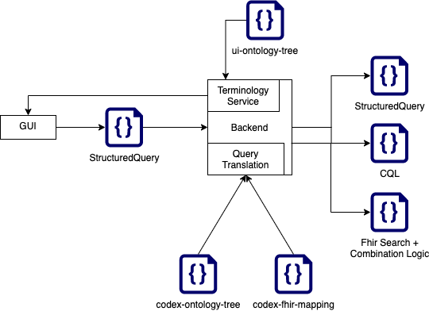

# Feasibility Query Translation

One aim of the codex project is to create a user interface for feasibility queries, which works directly with the FHIR standard.

This description focusses on the query translation itself, for an overview of the whole project please refer to <https://github.com/num-codex/codex-develop/blob/main/README.md>

To achieve this the user input from the user interface has to be translated into queries, which can be executed on a FHIR server.

An overview of the components involved in this process is depicted in Figure 1 below.



Figure 1 - Overview of Query Translation Process

In this project we call the query, which is created by the user interface a "StructuredQuery", which contains all the logic and input neccessary to translate the query into two common ways to search on a FHIR Server: FHIR Search and CQL.

The Structured Query is defined here:
[Codex Structured Query Definition](https://github.com/num-codex/codex-structured-query/blob/main/structured-query/documentation/2021_01_29StructeredQueriesDocumentation(Draft).md)

For FHIR Search, the query needs to be translated into multiple queries and the combination logic applied to the results, as the specification of FHIR Search is limited.
The FHIR Search translator is part of the Flare project and can be found here: <https://github.com/num-codex/codex-flare>

For CQL, the query can be translated into one CQL String which can be send to and executed on a CQL ready FHIR Server directly.
The CQL query translator can be found here: <https://github.com/num-codex/codex-sq2cql>

To achieve the translation from a general user interface format to FHIR format and to display the single Search Criterions for the user we need the following files:

A detailed description of how these files are generated from the GECCO implementation guid and an Ontology Server can be found here: [Codex GECCO Mapping Generation](https://github.com/num-codex/codex-gecco-to-ui-profiles)

## Ontology Tree and mapping files

<br/>

### UI Ontology Tree

This file contains the ontology and therefore all criteria available to the user in the user interface.
It determines the order of display, the "categorisation" of the criteria and tells the user interface how to treat each criterion.

This ontology tree is split accross mulitple files, each responsible for Category, such as "Demographics". The ontology is always provided by the UI-Backend terminology service endpoint. The backend provides the option to load terminology based on categories or search through the terminology via a freetext search.

A JSON schema of the ui ontology tree can be found here: <https://github.com/num-codex/codex-gecco-to-ui-profiles/blob/main/schema/ui-profile-schema.json>

<details>
<summary> UI Ontology Tree - Example Excerpt </summary>

```json
{
  "children": [
    {
      "children": [
        {
          "children": [],
          "display": "Lungentuberkulose ohne Angabe einer bakteriologischen, molekularbiologischen oder histologischen Sicherung",
          "id": "74f37f47-b859-416c-b455-e05b42e4e93a",
          "leaf": true,
          "selectable": true,
          "termCode": {
            "code": "A16.2",
            "display": "Lungentuberkulose ohne Angabe einer bakteriologischen, molekularbiologischen oder histologischen Sicherung",
            "system": "http://fhir.de/CodeSystem/dimdi/icd-10-gm"
          },
          "timeRestrictionAllowed": false,
          "valueDefinitions": []
        }
      ],
      "display": "Anamnese / Risikofaktoren",
      "id": "2023aeda-7fba-4e4b-a502-f0aeea3b899f",
      "leaf": false,
      "selectable": false,
      "timeRestrictionAllowed": false,
      "valueDefinitions": []
    }
  ],
  "display": "Chronische Lungenerkrankungen",
  "id": "21694d62-f151-48f3-b882-397b1c4a540c",
  "leaf": false,
  "selectable": false,
  "termCode": {
    "code": "J98.4",
    "display": "Sonstige Ver\u00e4nderungen der Lunge",
    "system": "urn:oid:1.2.276.0.76.5.409"
  },
  "timeRestrictionAllowed": false,
  "valueDefinitions": []
}
```
</details>

<br/>

### Code Tree

This file contains a code tree, which allows the query translators to resolve (find) all the children for a "code" (criterion) inside a vocabulary. This then allows the final search query to search not only for a particular criterion, but also search for all the respective children.

Following the children element of the code tree would for example resolve I09 (<https://www.icd-code.de/suche/icd/code/I09.-.html?sp=SI09>) to I09,I09.0,I09.1,I09.2,I09.8,I09.9

A JSON schema of the code tree can be found here: <https://github.com/medizininformatik-initiative/feasibility-structured-query/blob/structured-query-v2/structured-query/example-json/2021_10_18_StructuredQueryV2Example.json>

<details>
<summary> Code Tree - Example Excerpt </summary>

```json
{
"children": [
    {
        "termCode": {
            "code": "I09.2",
            "display": "Chronische rheumatische Perikarditis",
            "system": "http://fhir.de/CodeSystem/bfarm/icd-10-gm",
            "version": "2023"
        }
    },
    {
        "termCode": {
            "code": "I09.9",
            "display": "Rheumatische Herzkrankheit, nicht n\u00e4her bezeichnet",
            "system": "http://fhir.de/CodeSystem/bfarm/icd-10-gm",
            "version": "2023"
        }
    },
    {
        "termCode": {
            "code": "I09.1",
            "display": "Rheumatische Krankheiten des Endokards, Herzklappe nicht n\u00e4her bezeichnet",
            "system": "http://fhir.de/CodeSystem/bfarm/icd-10-gm",
            "version": "2023"
        }
    },
    {
        "termCode": {
            "code": "I09.0",
            "display": "Rheumatische Myokarditis",
            "system": "http://fhir.de/CodeSystem/bfarm/icd-10-gm",
            "version": "2023"
        }
    },
    {
        "termCode": {
            "code": "I09.8",
            "display": "Sonstige n\u00e4her bezeichnete rheumatische Herzkrankheiten",
            "system": "http://fhir.de/CodeSystem/bfarm/icd-10-gm",
            "version": "2023"
        }
    }
],
"termCode": {
    "code": "I09",
    "display": "Sonstige rheumatische Herzkrankheiten",
    "system": "http://fhir.de/CodeSystem/bfarm/icd-10-gm",
    "version": "2023"
}
}
```
</details>

<br/>

### Term Code Mapping (FHIR)

This file contains the mappings from the criteria to FHIR resources. It is used by the query translators in combination with the StructuredQuery input to convert each criterion into a search string.
Each criterion is identified using the "code" and "system" attributes of the "key" attribute of each json criterion mapping object.
Each object contains the following elements:

| Element     | Description                      | Example Value |
|-------------|----------------------------------|-------------- |
| fhirResourceType | The name of the FHIR resource and criterion is in | Observation            |
| fixedCriteria | Contains the definition of search parameters that always need to be set during a search | - |
| termCodeSearchParameter | Contains the search parameter which to use in order to find a criterion by its vocabulary code and system | code |
| valueSearchParameter | Contains the search parameter which to use in order to apply the allowed value filter of a criterion | value-quantity |
| valueFhirPath | Contains path to the element which to apply the value filter to for CQL translation of a criterion | value |
| timeRestrictionParameter | Contains the search parameter which to use in order to apply time restriction of a criterion | date |
| timeRestrictionPath | Contains path to the element which to apply the time restriction to for CQL translation of a criterion | value |

A JSON schema of the Codex Code Tree can be found here: <https://github.com/num-codex/codex-gecco-to-ui-profiles/blob/main/schema/term-code-mapping-schema.json>


<details>
<summary> Term Code Mapping - Excerpt Laboratory Value</summary>

```json
{{
        "fhirResourceType": "Observation",
        "key": {
            "code": "76769-9",
            "display": "Hemoglobin [Mass/volume] in Venous blood by Oximetry",
            "system": "http://loinc.org"
        },
        "termCodeSearchParameter": "code",
        "timeRestrictionParameter": "date",
        "timeRestrictionPath": "effective",
        "valueFhirPath": "value",
        "valueSearchParameter": "value-quantity"
    }
```
</details>

<details>
<summary> Term Code Mapping - Excerpt Condition</summary>

```json
{
        "fhirResourceType": "Condition",
        "key": {
            "code": "J98.4",
            "display": "Sonstige Ver\u00e4nderungen der Lunge",
            "system": "http://fhir.de/CodeSystem/bfarm/icd-10-gm",
            "version": "2023"
        },
        "termCodeSearchParameter": "code",
        "timeRestrictionParameter": "recorded-date",
        "timeRestrictionPath": "onset"
    }
```
</details>

<br/>

## Simple example feasibility query

<details>
<summary> Structured Query </summary>

```json
{
  "version": "http://to_be_decided.com/draft-1/schema#",
  "inclusionCriteria": [
    [
      {
        "termCode": {
          "code": "29463-7",
          "system": "http://loinc.org",
          "display": "Body weight"
        },
        "valueFilter": {
          "type": "quantity-comparator",
          "comparator": "gt",
          "unit": {
            "code": "kg",
            "display": "kg"
          },
          "value": 20.0
        }
      }
    ]
  ],
  "display": ""
}
```
</details>

<details>
<summary>CQL</summary>

```cql
library Retrieve
using FHIR version '4.0.0'
include FHIRHelpers version '4.0.0'

codesystem loinc: 'http://loinc.org'

define InInitialPopulation:
  exists from [Observation: Code '29463-7' from loinc] O
    where O.value as Quantity > 20.0 'kg'
```
</details>
<details>
<summary> FHIR Search + Combination Logic </summary>

```json
[
  [
    [
      "Observation?code=http://loinc.org|29463-7&value-quantity=gt20.0"
    ]
  ],
  []
]
```
</details>


## Complex example feasibility query

<details>
<summary>Structured Query</summary>

```json
{
  "version": "http://to_be_decided.com/draft-1/schema#",
  "inclusionCriteria": [
    [
      {
        "termCode": {
          "code": "29463-7",
          "system": "http://loinc.org",
          "display": "Body weight"
        },
        "valueFilter": {
          "type": "quantity-comparator",
          "comparator": "gt",
          "unit": {
            "code": "kg",
            "display": "kg"
          },
          "value": 20.0
        }
      }
    ],
    [
      {
        "termCode": {
          "code": "A16.2",
          "system": "http://fhir.de/CodeSystem/dimdi/icd-10-gm",
          "display": "Lungentuberkulose ohne Angabe einer bakteriologischen, molekularbiologischen oder histologischen Sicherung"
        }
      },
      {
        "termCode": {
          "code": "J61",
          "system": "http://fhir.de/CodeSystem/dimdi/icd-10-gm",
          "display": "Pneumokoniose durch Asbest und sonstige anorganische Fasern"
        }
      }
    ]
  ],
  "exclusionCriteria": [
    [
      {
        "termCode": {
          "code": "76769-9",
          "system": "http://loinc.org",
          "display": "Hemoglobin [Mass/volume] in Venous blood by Oximetry"
        },
        "valueFilter": {
          "type": "quantity-range",
          "unit": {
            "code": "g/dL",
            "display": "g/dL"
          },
          "minValue": 10.0,
          "maxValue": 20.0
        }
      }
    ]
  ],
  "display": ""
}
```
</details>

<details>
<summary> CQL </summary>

```cql
library Retrieve
using FHIR version '4.0.0'
include FHIRHelpers version '4.0.0'

codesystem cvs: 'http://terminology.hl7.org/CodeSystem/condition-ver-status'
codesystem icd10: 'http://fhir.de/CodeSystem/dimdi/icd-10-gm'
codesystem loinc: 'http://loinc.org'

define Inclusion:
  exists from [Observation: Code '29463-7' from loinc] O
    where O.value as Quantity > 20.0 'kg' and
  (exists from [Condition: Code 'A16.2' from icd10] C
    where C.verificationStatus.coding contains Code 'confirmed' from cvs or
  exists from [Condition: Code 'J61' from icd10] C
    where C.verificationStatus.coding contains Code 'confirmed' from cvs)

define Exclusion:
  exists from [Observation: Code '76769-9' from loinc] O
    where O.value as Quantity between 10.0 'g/dL' and 20.0 'g/dL'

define InInitialPopulation:
  Inclusion and
  not Exclusion
```
</details>

<details>
<summary> FHIR Search + Combination Logic </summary>

```json
[
  [
    [
      "Observation?code=http://loinc.org|29463-7&value-quantity=gt20.0"
    ],
    [
      "Condition?code=http://fhir.de/CodeSystem/dimdi/icd-10-gm|A16.2&verification-status=confirmed",
      "Condition?code=http://fhir.de/CodeSystem/dimdi/icd-10-gm|J61&verification-status=confirmed"
    ]
  ],
  [
    [
      "Observation?code=http://loinc.org|76769-9&value-quantity=ge10.0&value-quantity=le20.0"
    ]
  ]
]
```
</details>