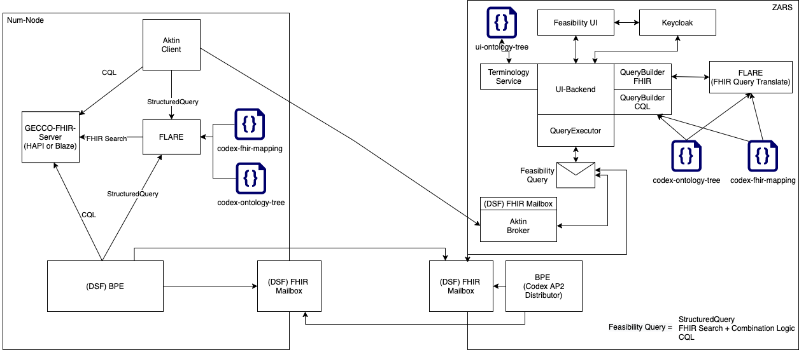

# codex-deploy

This codex deployment Repo offers an example deployment repository using Docker-compose and official codex images to setup an example environment.

It is divided into two parts:

A "ZARS" (Zentrale Antrags- und Registerstelle - Central Application and Registration Center) part, which creates a deployment of the centralized components neccessary for the deployment of the dezentralized feasibility query tool.

A "Num-Node" part, which provides a deployment for the decenctralized components

<figure class="image">
  
  <figcaption>Figure 1 - Overview Codex AP2 - Feasibility Queries</figcaption>
</figure>


## Initial Setup

### Step 1 - Initialise certificates

Use the `setup-all-base-auth.sh <username> <password>` to initialise the deployment with self signed certificates and setup basic auth for the num node.The `setup-all-base-auth.sh` requires two arguments. First the username, second the password for the user. 
This sets up a user and basic auth authentication for the FHIR server of the num-node and creates two sets of self signed certificates (cert.pem, key.pem) in the `num-node/auth` and `zars/auth`folders.


### Step 2 - Set up rights for certificates

Set the rights of the cert.pem and key.pem files to 655.

`chmod 655 zars/auth/* num-node/auth/*`

### Step 3 - Start Zars and Num-Node

Use the `start-zars-and-num-node.sh` to start up the ZARS and num node.

Additional flags are explained when running `start-zars-and-num-node.sh -h`. 


### Step 4 - Restrict rights for certificates 

Once keycloak has successfully started up, set the rights of the certificate files to 600.

`chmod 600 zars/auth/* num-node/auth/*`

### Step 5 - Initialise test data (optional)

If you would like to test your setup you can initialise the testdata provided with this repository

`cd num-node && bash init-testdata.sh`


## Exposed Services

Services exposed via the two nginx reverse proxys provided:

| Service                      | URL                                              | Part of  | Default User | Default Password |
|------------------------------|--------------------------------------------------|----------|---------------------|-----------|
| Feasibility GUI              | <https://localhost>                              | ZARS     | codex-developer     | codex     |
| Feasibility UI backend       | <https://localhost/api>                          | ZARS     | connect via keycloak| -         |
| Keycloak                     | <https://localhost/auth>                         | ZARS     | admin               | admin     |
| (GECCO) FHIR Server          | <https://localhost:444/fhir>                     | Num-Node | -                   | -         |
| Flare                        | <https://localhost:444/flare>                    | Num-Node | -                   | -         |


Direct (non reverse proxy) access to the services:

| Service                      | URL                                              | Part of  | Default User | Default Password |
|------------------------------|--------------------------------------------------|----------|--------------|------------------|
| feasibility backend          | <http://localhost:8091>                          | ZARS     | -            | -                |
| flare zars (for translation) | <http://localhost:5001>                          | ZARS     | -            | -                |
| Aktin Broker                 | <http://localhost:8082>                          | ZARS     | admin        | changeme         |
| keycloak                     | <https://localhost:8443>                         | ZARS     | admin        | admin            |
| flare num node               | <http://localhost:5000>                          | Num-Node | -            | -                |
| FHIR Server                  | <http://localhost:8081>                          | Num-Node | -            | -                |


## Certificates

Both the ZARS as well as the Num-Node require certificates to be set up as these are required to run the system with HTTPS on deployment.
If you have followed the setup steps above, you should have self signed certificates set up in the respective `auth` folders.
To install your own certificates stop the ZARS and num node (`stop-zars-and-num-nodes.sh`) and replace the respective cert.pem and key.pem with your own files (note: the file name has to stay the same).

Startup the services again `start-zars-and-num-node.sh`.


## Sending your first feasibility request

Please be aware, that we are using self-signed certificates in the initial setup, which your browser will flag and for some browsers will not allow you to continue to the websites.

We found that firefox works best. Navigate to the respective service exposed via the nginx webservers above and accept the risk.

After setting up your FHIR server, check if the FHIR server contains some test data:
<https://localhost:444/fhir/Patient>   (user and password as set before)

Access the user interface <https://localhost> and log in:
- username: codex-developer
- password: codex

If you have loaded the test data provided with the repository you can create a query with one inclusion criterion "Biologisches Geschlecht" = female.
This criterion can be found under "Demographie" > "Biologisches Geschlecht".

It will take a couple of seconds, but should the user interface should then return "1".

## Sending a feasibility request via REST

You can also send a request to the UI backend via REST. 


``` bash
# request access token
curl -k --location --request POST 'https://localhost/auth/realms/codex-develop/protocol/openid-connect/token' \
--header 'Content-Type: application/x-www-form-urlencoded' \
--data-urlencode 'grant_type=password' \
--data-urlencode 'client_id=feasibility-gui' \
--data-urlencode 'scope=openid' \
--data-urlencode 'username=codex-developer' \
--data-urlencode 'password=codex'

# run query
curl -k --location --request POST 'https://localhost/api/v1/query-handler/run-query' \
--header 'Authorization: Bearer <insert-access_token-from-token-request-above-response-here>' \
--header 'Content-Type: application/json' \
--header 'Cookie: JSESSIONID=node0v3dnl2dqawhlbymawm3cl7ib22.node0' \
--data-raw '{
    "version": "http://to_be_decided.com/draft-1/schema#",
    "inclusionCriteria": [
        [
            {
                "termCode": {
                    "code": "76689-9",
                    "system": "http://loinc.org",
                    "display": "Sex assigned at birth"
                },
                "valueFilter": {
                    "type": "concept",
                    "selectedConcepts": [
                        {
                            "code": "female",
                            "system": "http://hl7.org/fhir/administrative-gender",
                            "display": "Female"
                        }
                    ]
                }
            }
        ]
    ],
    "display": ""
}'

# get query result
curl -k --location --request GET '<insert-location-header-url-from-above-request-response-here>' \
--header 'Authorization: Bearer <insert-access_token-from-token-request-above-response-here>' \
--header 'Content-Type: application/json'
```

## Components

The following components alongside their versions are used within this deployment:

### NUM-Node
| Component | Version |
|-----------|---------|
|aktin-client|1.1.3|
|codex-processes-ap2/fhir|0.1.0-rc5|
|codex-processes-ap2/bpe|0.1.0-rc5|
|samply/blaze|0.11.0-alpha.6|
|hapi-fhir-jpaserver-starter|5.2.0-distroless|
|codex-flare|0.0.2|
|nginx-unprivileged|1.20-alpine|

### ZARS:
| Component | Version |
|-----------|---------|
|aktin-broker|1.1.3|
|codex-feasibility-backend|0.0.3|
|codex-processes-ap2/fhir|0.1.0-rc5|
|codex-processes-ap2/bpe|0.1.0-rc5|
|codex-flare|0.0.2|
|codex-feasibility-gui|0.0.2|
|codex-keycloak|0.0.1|
