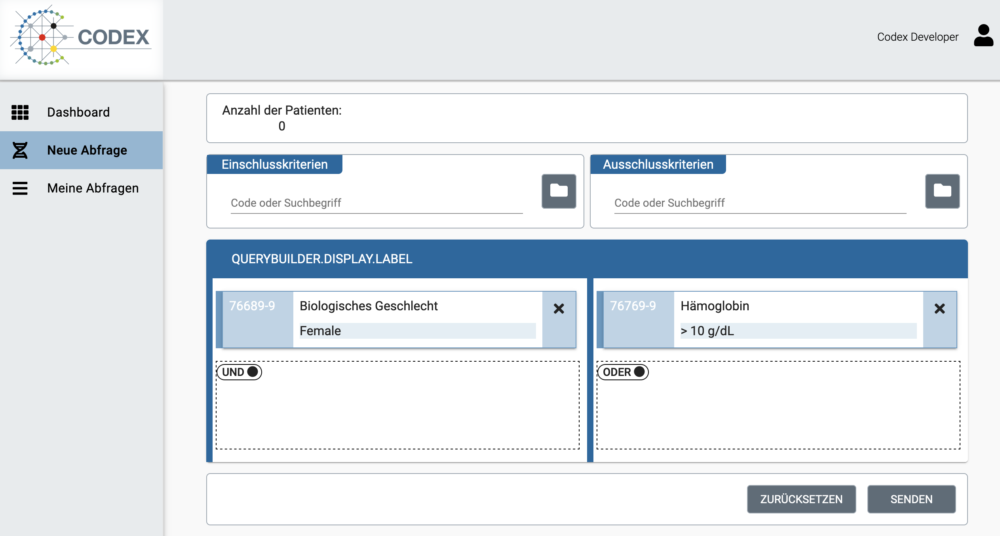

# Codex Feasibility Platform

The codex feasibility platform provides a feasibility query user interface with an appropriate backend, query translation to CQL and FHIR Search as well as 
two Middlewares for the transfer of the queries from the feasibility platform to the so called num-nodes located inside hospitals.

The feasibility platform can be run standalone inside a data integration center for local queries or, if connected via the middlewares provided as part of this project,
connected to decentral num-nodes inside data integration centers.

The feasibility gui allows a researcher to define feasibility queries, by combining inclusion and exlcusion search criterions using boolean logic (see example Figure 1 below).

<figure class="image">
  
  <figcaption>Figure 1 - Example feasibility query</figcaption>
</figure>

An overview of the platform is depicted in Figure 2 below and shows the architecture of the complete system neccessary for distributed dezentralized feasibility queries accross multiple independent institutions.

<figure class="image">
  
  <figcaption>Figure 2 - Overview Codex AP2 - Feasibility Queries</figcaption>
</figure>

the System includes one central platform (ZARS) and multiple Num-Nodes the central platform connects to.
The central part is responsible for providing the user interface and translating the user input into and generating three types of queries (Structured Query, CQL, FHIR Search) to be send to the Num-Nodes.

The query translation is described in more detail here: 
[Query Translation](../Feasibility-Query.md)

The other components, which are part of the central platform are:
- [Feasibility GUI](https://github.com/num-codex/codex-feasibility-gui)
- [Feasibility Backend](https://github.com/num-codex/codex-feasibility-backend)
- [Flare Query Translation](https://github.com/num-codex/codex-flare)
- [CQL Query Translation](https://github.com/num-codex/codex-sq2cql)
- [Keycloak](https://github.com/num-codex/codex-keycloak) (This keycloak is for development purposes only, for deployment a new keycloak should be configured)
- [Aktin Broker - Middleware - Option 1](https://github.com/aktin/broker)
- [DSF Broker - Middleware - Option 2](https://github.com/num-codex/codex-processes-ap2)

For further details on each component please refer to the respective repositories.

