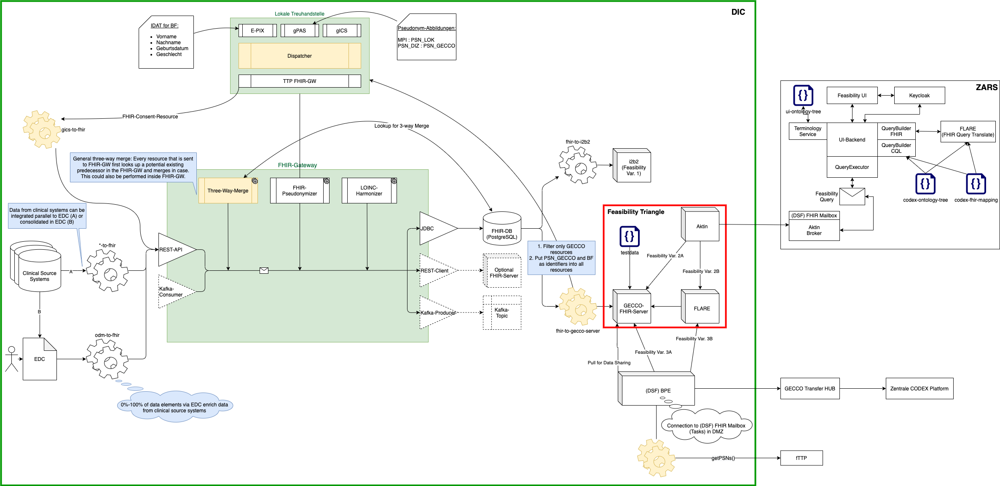

# The Codex Num-Node - Feasibility Queries

The Num-Node part of this Repository provides a site (data integration center) with all the neccessary components to set up in order to allow feasibiliy queries from the central feasibility platform.

It is to be integrated with other parts of the Num-Node (see [Num-Node Repository](https://github.com/num-codex/num-knoten)).

It can however be installed by itself in order to test the feasibility query setup and be later switched to a production environment.

## Setting up the Num-Node for Feasibility Overview

This setup is configured to install the so called "feasibility triangle" on one VM, which combines the minimum neccessary components to load data into a FHIR store and connect to a central feasibility query platform.

<figure class="image">
  
  <figcaption>Figure 1 - Overview Num Node Feasibility Triangle</figcaption>
</figure>

We will describe the setup process for all components on the same VM inside the same docker network here and then describe all components in more detail including the configuration variables and their purpose within the Num-Node.

The Num-Node parts here are only part of the Num-Node components to be deployed and can be later configured to work with the ETL Num_Node components described as part of the [Num-Node V2](https://github.com/num-codex/num-knoten).

## Setting up the Num-Node on one VM

### Step 1 - clone this Repository to your virtual machine

ssh to your virtual machine and switch to sudo `sudo -s`.
Create a folder for your setup, we suggest /opt/num-node (`mkdir -p /opt/num-node`)
Navigate to the directory and clone this repository: `git clone https://github.com/num-codex/codex-deploy`
Navigate to the num-node folder of the repository: `cd /opt/num-node/codex-deploy/num-node`

### Step 2 - Setup basic auth

To set up basic auth you can execute the `setup-base-auth.sh <username> <password` to create a self signed certificate and add a simple .htpasswd to protect your num-node with basic authentication.
This creates a cert.pem and key.pem file in the `auth` directory, which will be mounted to the nginx, which is part of this deployment repository. It also creates a `.htpasswd` file in the `auth` folder

We do however recommend that you use your own certificates and a domain of your choosing. The certificates can be changed at any time later on - see "Change Certificate" below.

### Step 3 - Configure your Num-Node

To configure the Num-Node to work with the central feasibility platform the only part that needs to be configured for a test setup is the `aktin-client`.

#### 3.1 Broker API-Key

Ask for an API key for the central platform from the central platform team and add the API key in the `aktin-client/.env` file by replacing the `CLIENT_AUTH_PARAM` env variable.

#### 3.2 Broker Endpoint

Ask for the Broker Endpoint Uri for the central platfrom from central platform team and add the URI in the `aktin-client/.env` file by replacing the `BROKER_ENDPOINT_URI` env variable.

### Step 4 - Start the Num-Node

Switch back to the num-node folder `cd ..`

To start the Num-Node execute the `start-node.sh`.

This starts a standard Num-Node Setup, which includes:
- Aktin-Client: used to connect to the central platform and allow queries from the Zars
- GECCO FHIR Server: The FHIR Server which will later hold the GECCO patient data for feasibility queries
- Flare: A Rest Service, which is needed to translate, execute and evaluate a feasibility query on a FHIR Server

### Step 5 - Access the Num-Node

The Num-Node will expose the following services.

These are the URLs for access to the webclients via nginx:

| Component   | URL                              | User             | Password         |
|-------------|----------------------------------|------------------|------------------|
| Flare       | <https://your-domain/flare>   | chosen in step 2 | chosen in step 2 |
| FHIR Server | <https://your-domain/fhir>      | chosen in step 2 | chosen in step 2 |

Accessible service via localhost:

| Component   | URL                              | User             | Password         |
|-------------|----------------------------------|------------------|------------------|
| Flare       | <http://localhost:5000>          | None required    | None required    |
| FHIR Server | <http://localhost:8081>          | None required    | None required    |

Please be aware, that if you would like to access the services on localhost without a password you will need to
set up an ssh tunnel to your server and forward the respective ports.

For example for the FHIR Server: ssh -L 8081:127.0.0.1:8081 your-username@your-server-ip

### Step 6 - Init Testdata (Optional)

If you would like to test your setup you can initialise the testdata provided with this repository.

`bash init-testdata.sh`

Alternatively if you are part of the CODEX project, please download the  testdata here:

https://confluence.imi.med.fau.de/download/attachments/156379181/gecco-feasibility-testdata.zip?version=1&modificationDate=1624281356939&api=v2

remove the current testdata and unzip the file in the testdata directory of this projects num-node folder.

`rm -f testdata/* && unzip gecco-feasibility-testdata.zip -d testdata`

then execute `bash init-testdata.sh` to load the testdata in your FHIR server

## Change Certificate

To change the certificate of the Num-Node request a cert.pem and key.pem file from your institution and add replace the cert.pem and key.pem files in the `auth` folder.

After replacing the *.pem files restart the num-node using the `stop-node.sh` and `start-node.sh` in sequence.

